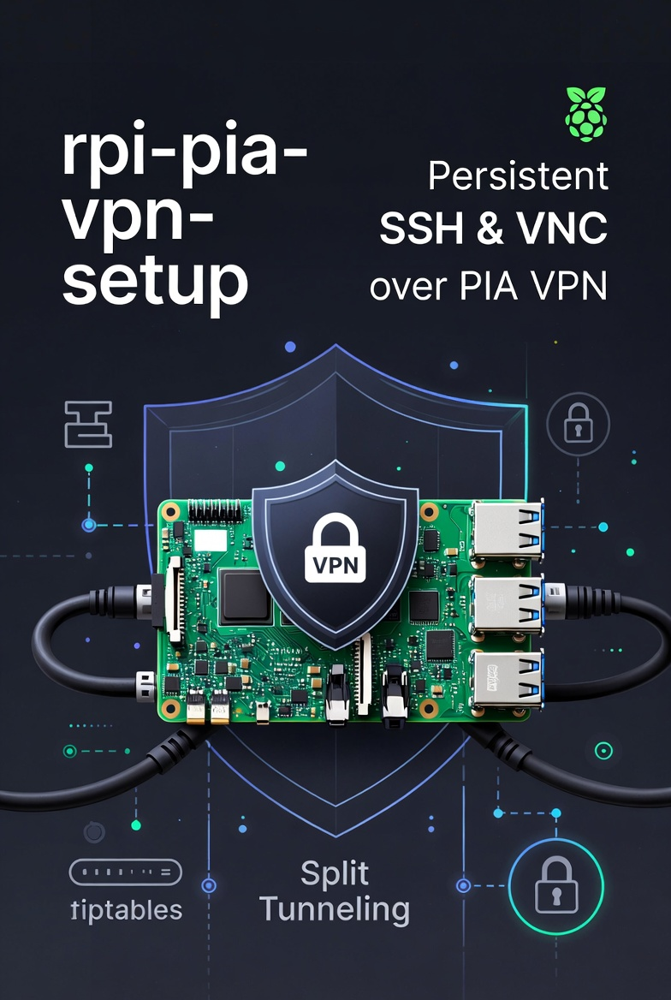

# Raspberry Pi PIA VPN with Persistent SSH & VNC Access

  

**Production-ready setup** running Private Internet Access (PIA) VPN on a Raspberry Pi while keeping full local SSH and VNC access from trusted VLANs.

---

## ✨ Key Features

- Split tunneling via iptables (VPN for torrents, local access remains direct)
- Persistent configuration across reboots (`netfilter-persistent` + systemd)
- Secure access from Management + Clients VLANs
- Tailscale as backup remote access
- Fully documented for future reinstalls

---

## 🚀 Quick Start

1. Install PIA VPN → [`docs/PIA-Installation.md`](docs/PIA-Installation.md)
2. Configure split tunneling → [`docs/iptables-split-tunnel.md`](docs/iptables-split-tunnel.md)
3. Set up systemd services → [`docs/Systemd-Services.md`](docs/Systemd-Services.md)
4. Add EdgeRouter-4 firewall rules → [`docs/ER4-Firewall-Rules.md`](docs/ER4-Firewall-Rules.md)

---

## 📖 Full Documentation

| Document | Description |
|----------|-------------|
| [`docs/PIA-Installation.md`](docs/PIA-Installation.md) | PIA VPN installation steps |
| [`docs/iptables-split-tunnel.md`](docs/iptables-split-tunnel.md) | Split tunneling configuration |
| [`docs/Systemd-Services.md`](docs/Systemd-Services.md) | Persistent services |
| [`docs/ER4-Firewall-Rules.md`](docs/ER4-Firewall-Rules.md) | EdgeRouter-4 rules |
| [`docs/VLAN-Overview.md`](docs/VLAN-Overview.md) | Homelab VLAN architecture |
| [`docs/Troubleshooting.md`](docs/Troubleshooting.md) | Common issues & fixes |

---

## 🛡️ Security Highlights

- SSH (port 22) and VNC (port 5900) bypass VPN
- Only trusted VLANs allowed
- Tailscale fallback for external access

---

## 🤝 Contributing

Suggestions for improving split tunneling or adding WireGuard support are welcome!

---

## 📄 License

[MIT License](LICENSE) © 2026 Duc Nguyen

---

**Star this repo if it helped you run VPN securely in your homelab!** 🔒

_Last updated: May 2026_